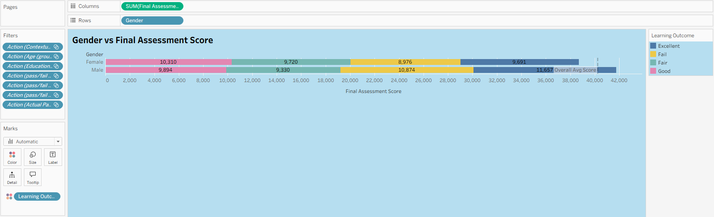
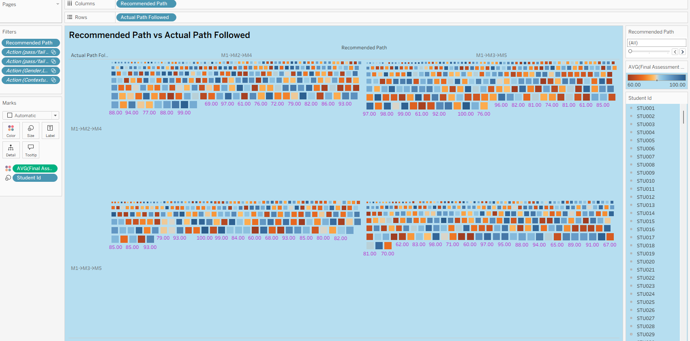
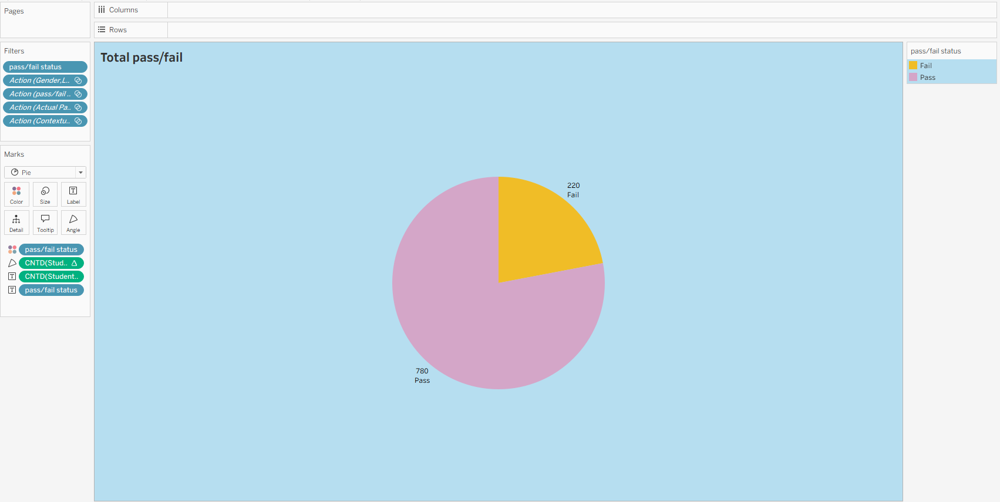
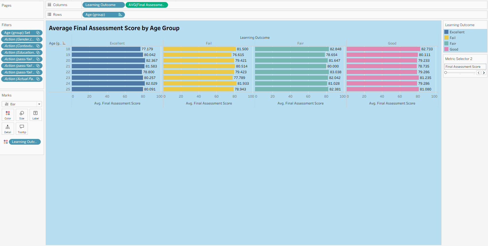
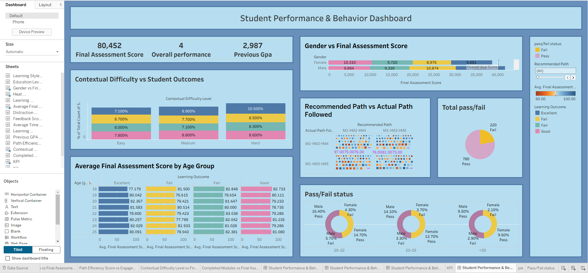
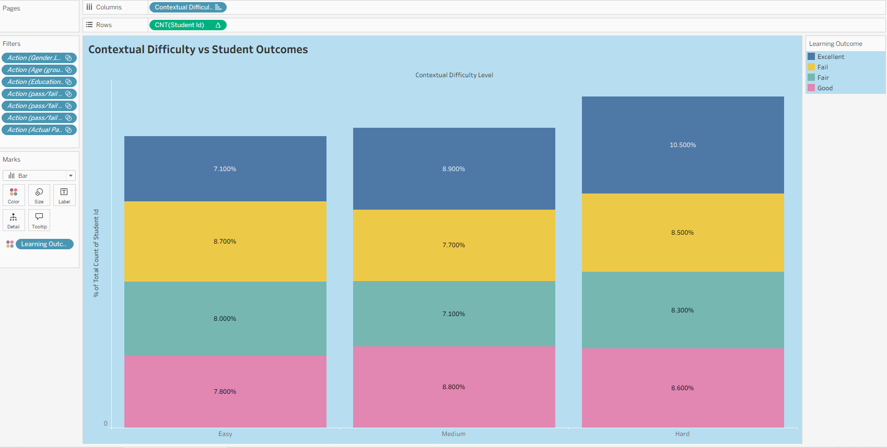

# AI-Powered Personalized Learning Analytics using Tableau

## Overview

This project analyzes student performance, engagement, and learning behavior using AI Personalized Learning data and interactive dashboards developed in Tableau. The system helps identify trends, learner patterns, and factors affecting academic success in adaptive learning environments.

---

## Features

* Interactive Tableau dashboards
* Student performance analysis
* Pass/Fail visualization
* Learning path adherence analysis
* Age and gender-based performance comparison
* Heatmaps and trend analysis
* Data-driven educational insights

---

## Technologies Used

* Tableau
* Python (Data preprocessing)
* CSV Dataset
* AI Personalized Learning Dataset

---

## Dataset Attributes

The dataset includes:

* Student ID
* Age
* Gender
* Assessment Scores
* Learning Outcome
* Recommended Learning Path
* Actual Path Followed
* Contextual Difficulty Level
* Pass/Fail Status

---

## Objectives

* Analyze learner engagement and performance
* Identify patterns affecting academic outcomes
* Evaluate effectiveness of personalized learning paths
* Support adaptive learning strategies using visual analytics

---

## Visualizations Included

### Chart 2 – Contextual Difficulty Level vs Final Assessment Score

### Chart 3 – Gender vs Final Assessment Score

### Chart 4 – Recommended Path vs Actual Path Followed

### Chart 5 – Total Pass/Fail Distribution

### Chart 6 – Average Final Assessment Score by Age Group

### Dashboard – Student Performance & Behavior Dashboard

### Main Project Image

---

## Results

* Students following recommended learning paths achieved higher scores.
* Consistent engagement improved academic performance.
* Minimal variation was observed across age and gender groups.
* Most students successfully passed, indicating effective adaptive learning support.

---

## Conclusion

The project demonstrates how AI-driven analytics and Tableau dashboards can transform educational data into actionable insights, helping educators improve personalized learning and decision-making.

---

## How to Run

1. Open the Tableau workbook (.twb/.twbx).
2. Connect the dataset file (.csv/.xlsx).
3. Refresh the data source if needed.
4. Explore dashboards and visualizations interactively.

---

## Future Enhancements

* Real-time learner analytics
* Predictive performance modeling
* AI-based recommendation systems
* Integration with Learning Management Systems (LMS)

---

## Author
Laxmipriya Rout

Project developed for educational analytics and personalized learning research.
